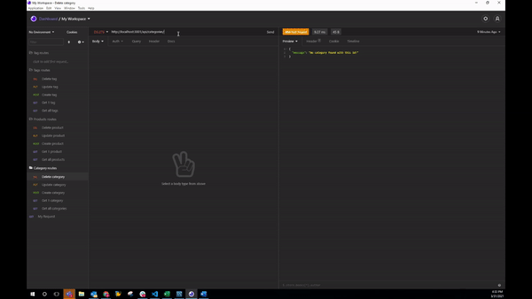

# eCommerce back end

## Table of Contents

1. [Project description](#Project-description)
2. [Istallation instruction](#Installaton-instructions)
3. [Usage information](#Usage-information)
4. [Contribution guidelines](#Contribution-guidelines)
5. [Test instructions](#Test-instructions)
6. [License](#License)
7. [Questions](#Questions)

## Project description:

The project is the back end for an e-commerce site. To keep track of products, categories, tags, and cost/stock of items.

## Installation instructions:

Install NPM modules Sequelize and MySQL database.

see the video below for details on how to run the program.

1. Part 1: https://drive.google.com/file/d/1WhNIOb8_MzLGV0lJ_ItMCJteb9m3ZvmN/view?usp=sharing
2. Part 2: https://drive.google.com/file/d/1Flc2deoYYQxDzF5DLf7B3y2az3X3m_xn/view?usp=sharing
3. Part 3: https://drive.google.com/file/d/1R_dprTFgYbt7VLLGCEcYWD-zWKsNUBjV/view?usp=sharing

A GIF from the insomnia section video:

1. Run the program and view/update informaiton in the database:

## Usage information:

Through this application the user can get a list of all categories, products, or tags. The user can also look up individual items (i.e. categories, products, tags) by their ID, can update the relevant information, or can delete the information by ID.

## Contribution guidelines:

Class examples and TA's Ryan and Zac

## Test instructions:

None

## License:

This application is covered under the MIT license.

## Questions:

https://www.github.com/reybrac

Reach me at reybrac@yahoo.com for additional questions
